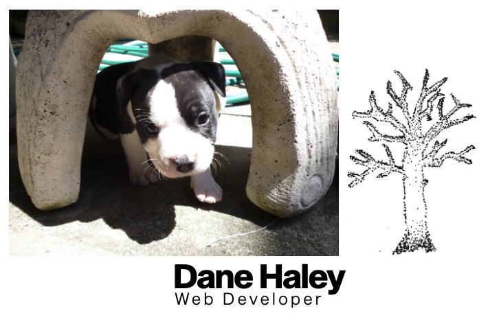

# danehaley.codes (v2)
A portfolio website made with React & SCSS - hosted via github pages at [danehaley.codes](https://danehaley.codes)   
   
## Home
The homepage of the website contains decorative media, as well as a link navigation bar to navigate through the different sections of the site.

## Skills
The skills page of the website has a dynamic list of my skills categorized via "Languages", "Tools", and "Miscellaneous". 

## Projects

## Education

## Resume
